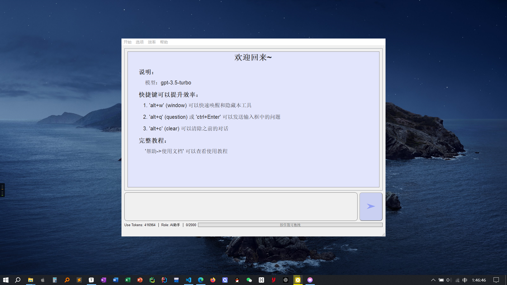
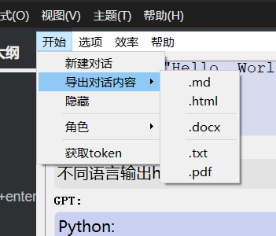
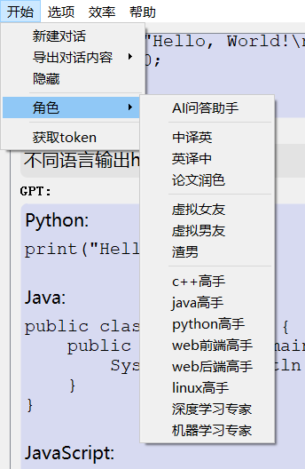

# Quick-Chat

***——欢迎使用quickChart***

## 界面

## 快捷键

* 推荐和鼓励使用快捷键，这将大大提高你的使用效率

### alt+w(window)

* 快速调出和隐藏本工具 

### alt+q(question) / ctrl+enter

* 快速发送输入框问题 

### alt+c(clear)

* 清空对话内容

## 基础使用

### 开始

#### 新建对话

* 清空先前的对话内容，开始一段全新的对话，可以使用快捷键**alt+c(clear)**提高效率。

#### 导出对话内容

* 可以将当前的对话内容以多种格式导出。
* 需要注意的是，清除历史对话内容后，或者到达对话轮数上限后，之前的内容就没了。
* 推荐使用md格式导出，模型的数据返回就是markdown格式的。也可以利用其他更成熟的markdown编辑器导出想要的格式
* 如果要使用doc pdf导出请使用pandoc.exe

#### 隐藏

* 隐藏本工具，可用全局快捷键**alt+w**隐藏和呼出，或在系统托盘打开。

#### 角色

* 设置提示词，扮演指定的角色

#### 获取tocken

* 查看设备id，用 tools/激活码生成.py 生成激活码，填入config文件中（如果有商业需求的话）

### 选项

#### 个性化

* 暂不支持

#### 模型切换

* 暂不支持

#### 设置开机自启

* 字面意思，软件可以挂在后台，快捷键alt+w(window)可以唤醒和隐藏。
* 如果开机自启不生效，可以前往用户文件夹删除**map.cf**映射文件然后重新设置开机自启。当然还有另一种可能就是**安全软件**禁止了开机自启的行为。
* map文件路径：C:\\Users\\{你的用户名}\\.quickChart

#### 取消开机自启

* 顾名思义。

### 效率

### 帮助

#### 使用教程

* 打开你现在在看的文档。

#### 检查更新

* 下载新版的软件，或者我的其他软件。

#### 阿里云服务

* 通义千问的API，使用自己的API key来调用，使用Qwen.py可以使用通义千问的API（不免费了，就不用了）

#### 赞助

* 可以给我打钱。

## 其他功能

### 页面调整

